Nama: Gita Mustika Pratiwi

Nim: 312110303

Kelas: TI.21.C5

Berikut adalah data file yang sudah saya buat untuk menjawab soal UAS dari dosen saya

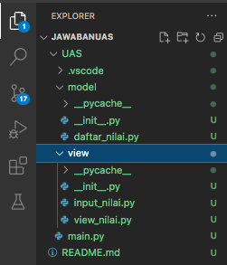

SOAL 1 (Daftar_Nilai)

Pada soal pertama, dibawah ini saya telah menyantumkan beberapa syntax yang nantinya akan menghasilkan semua modul dari package Daftar_Nilai yang diantaranya adalah (Tambah Data, Ubah Data, Hapus Data, Dan Cari Data)
Gunakan fungsi def tambah()di isi dengan inputan nama, nim, tugas, uts, uas dan perhitungan nilai akhir untuk dan di masukan ke dataM ahasiswa.

Gunakan fungsi def tampilkan() di isi dengan cetak isi dari dictonary.

Gunakan fungsi def hapus(nama) di isi dengan syntax delet untuk menghapus element nama pada dictonary dataMahasiswa.

Gunakan fungsi def ubah(nama) di isi dengan inputan nama dan mengubah isi element pada nama tersebut.

Gunakan while True untuk menlooping/mengulang statment.

Gunakan statment if, elif, else, di dalam while True dan panggil fungsi dari masing masing fungsi
berikut adalah syntax input nilainya

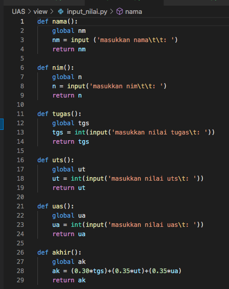

Disini saya akan mencoba untuk menguraikannya. Pertama untuk menghasilkan modul Tambah Data kamu perlu memasukan syntax dibawah ini.

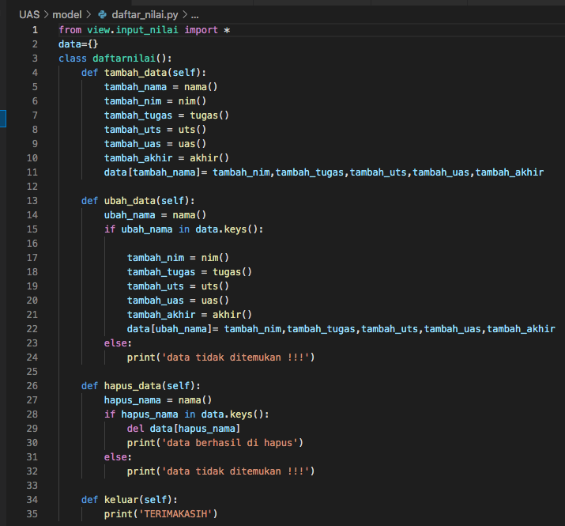

Jadi kesimpulannya jika kalian menggunakan semua syntax yang saya tunjukan diawal dan kalian run program dan memasukan '1' pada kolom maka akan mendapat output seperti dibawah ini, yang dimana itu adalah hasil untuk menambahkan data.

hasil output tambah data

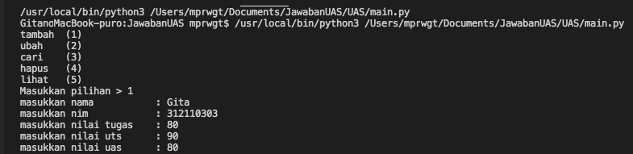
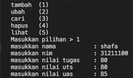

syntax untuk menampilkan hasil program

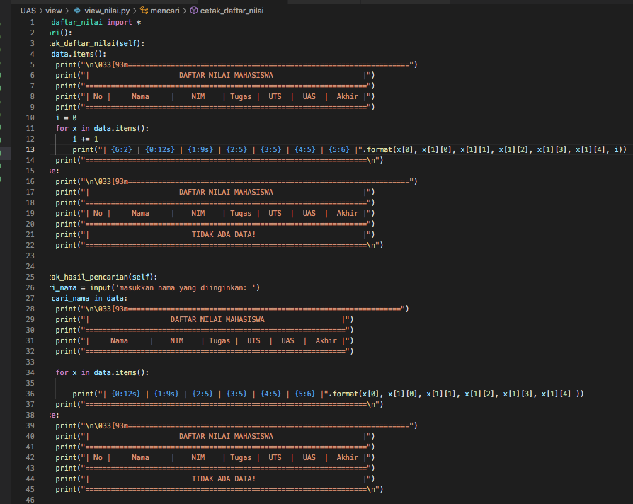

hasil output ubah data

 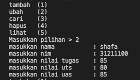
 
 hasil output cari data

 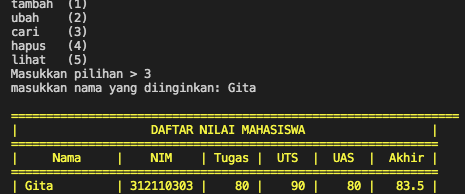

 hasil output hapus data

 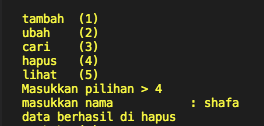

 hasil output lihat data

 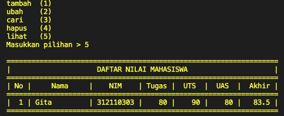

dan berikut adalah Syntax untuk mencetak semua program 

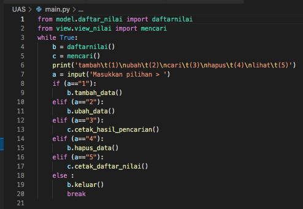

